# joyplot - 
Draw joyplot (ridgeline plot) with rug marks, median lines, quantiles, and 5 ColorModes options.

+ 'Order'    - Uniform color per ridge (cycles through color list)
+ 'X'        - Gradient based on X position within each ridge (local)
+ 'GlobalX'  - Gradient based on global X position across all ridges
+ 'Kdensity' - Gradient based on kernel density height (Y value)
+ 'Qt'       - Discrete colors based on quantile intervals

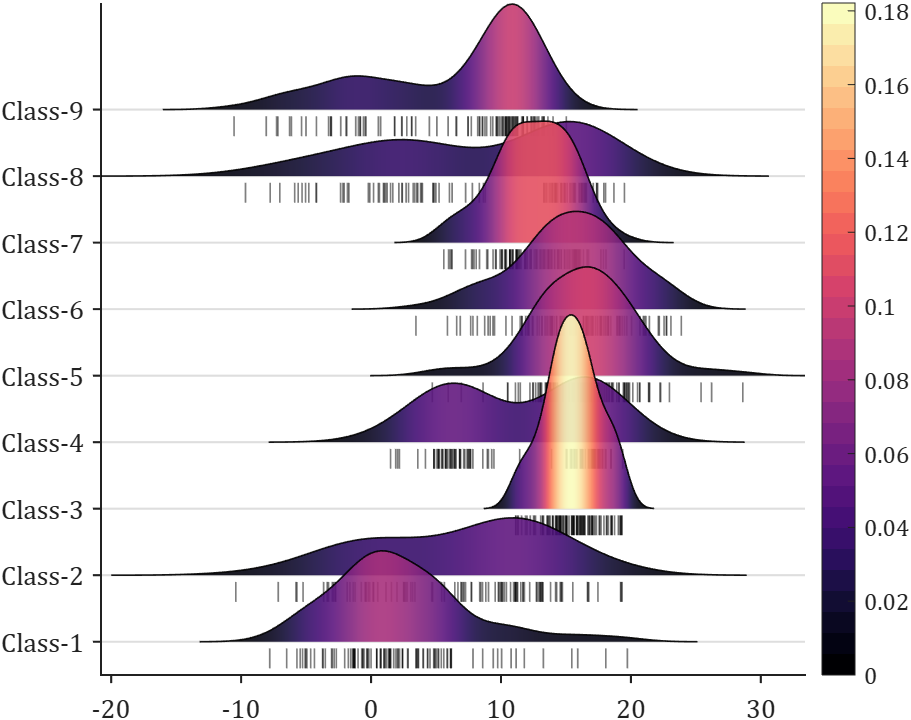

## Basic usage
We expect Data in the following format:

Data  = {X1, X2, X3, ...}

, where each Xi is a numeric vector. The Xi vectors may have different lengths.
```matlab
figure()
% Create joyplot object and draw.
JP = joyPlot(Data, 'ColorMode','Order');
JP = JP.draw();
% Create handles for legend and display.
lgdHdl = JP.getLegendHdl();
legend(lgdHdl)
```
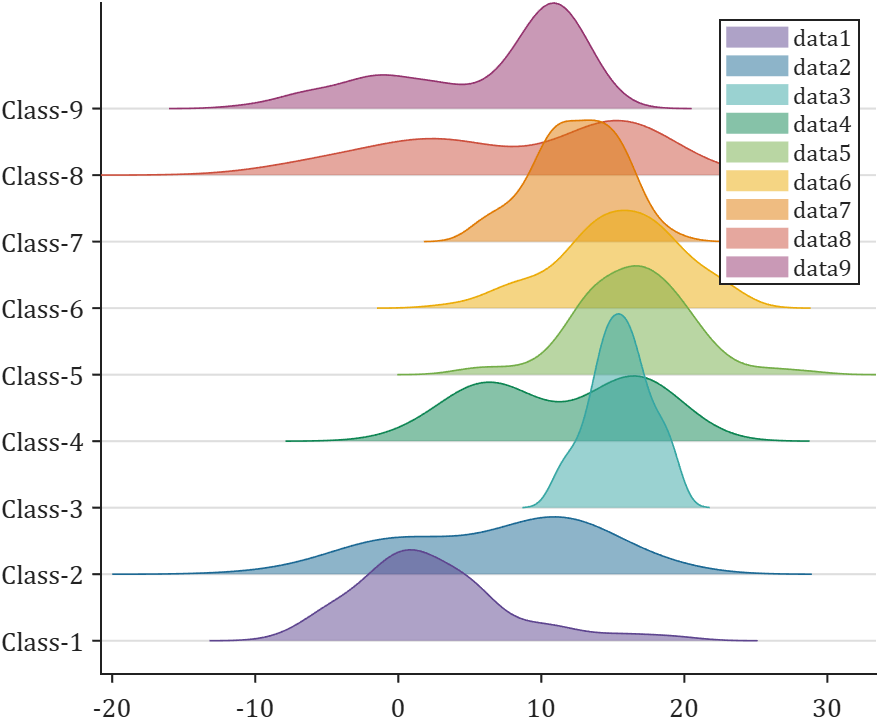
```matlab
%% Change color
figure()
% Create joyplot object, change color and draw.
JP = joyPlot(Data, 'ColorMode','Order');
JP.ColorList = [.88 .57 .26; 1.0 .66 0.0; .83 .43 .06;
                .29 .64 .61; .41 .72 .98; .34 .63 .97;
                .29 .56 .96; .35 .49 .79; .41 .42 .62];
JP = JP.draw();
% Create handles for legend and display.
lgdHdl = JP.getLegendHdl();
legend(lgdHdl)
```
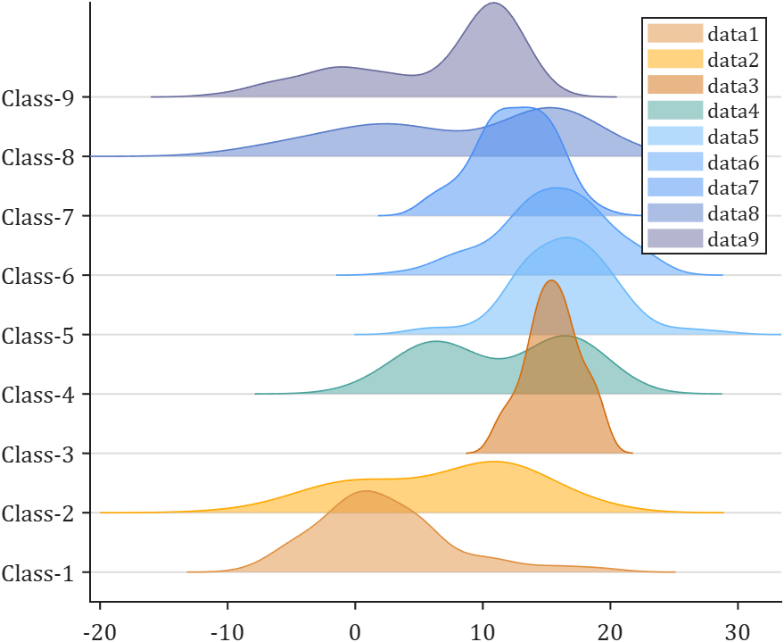
```matlab
%% larger ridge separation
figure()
% Create joyplot object with larger ridge separation and draw.
JP = joyPlot(Data, 'ColorMode','Order', 'Sep', 1/5);
JP = JP.draw();
% Create handles for legend and display.
lgdHdl = JP.getLegendHdl();
legend(lgdHdl)
```
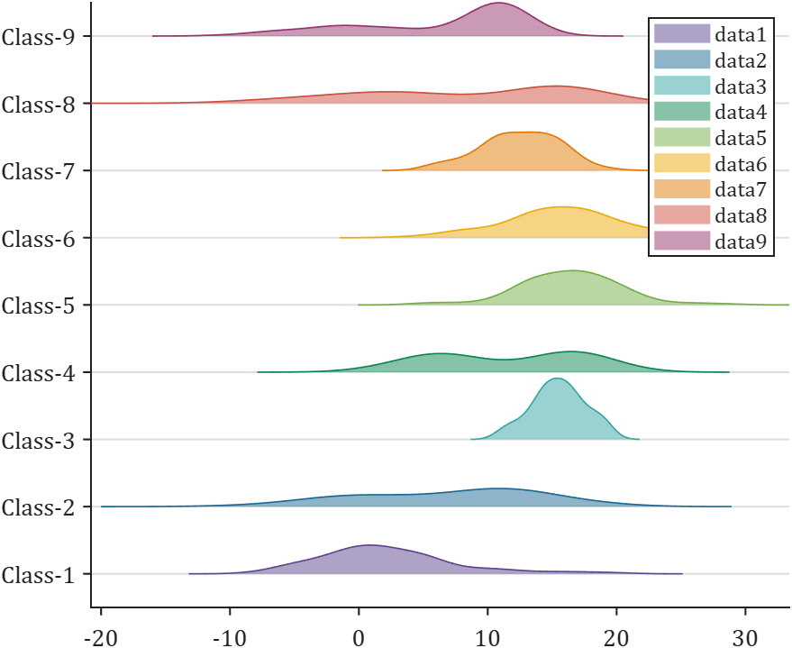
## ColorMode : 'X' and 'GlobalX', with midline
```matlab
%% ColorMode : 'X'
figure()
% Create joyplot object with 'X' ColorMode and median line.
JP = joyPlot(Data, 'ColorMode','X', 'MedLine','on');
% JP.ColorList = pink(20); % Change colormap.
JP.draw();
colorbar()
```
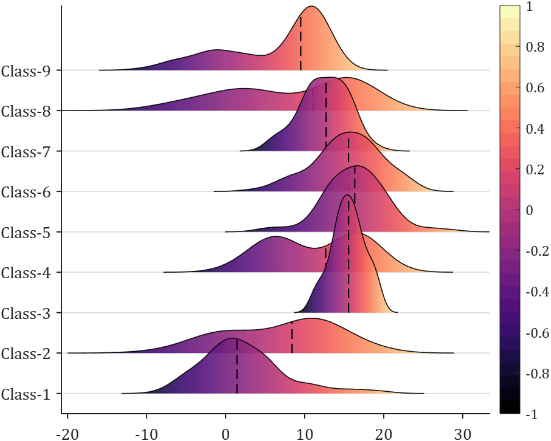
```matlab
%% ColorMode : 'GlobalX
figure()
% Create joyplot object with 'GlobalX' ColorMode and median line.
JP = joyPlot(Data, 'ColorMode','GlobalX', 'MedLine','on');
% JP.ColorList = pink(20); % Change colormap.
JP.draw();
colorbar()
```
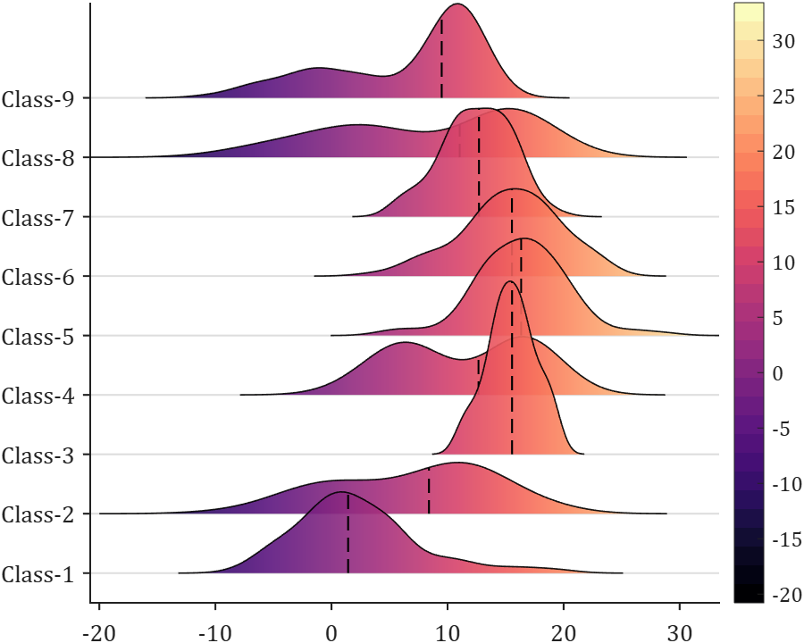
## ColorMode : 'Kdensity' with midline and vertical scatter points(rug)
```matlab
% Create joyplot object with 'Kdensity' ColorMode and vertical scatter points.
JP = joyPlot(Data, 'ColorMode','Kdensity', 'Scatter','on');
JP = JP.draw();
colorbar()
% Another way of changing colors/colormap.
JP.setPatchColor(pink);
```
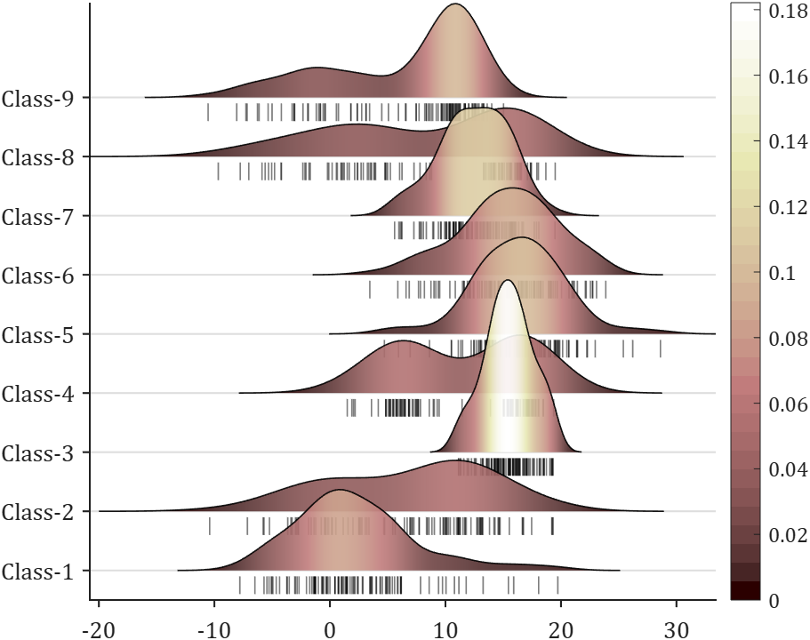
## ColorMode : 'Qt' with custom quantile boundaries 
```matlab
%% demo 4 - 1 : Quantile coloring with 3 intervals (IQR: 25%-75%)
figure()
JP = joyPlot(Data, 'ColorMode','Qt', 'MedLine','on', 'Quantiles',[.25,.75], 'QtLine','on');
JP = JP.draw();
% Create handles for legend and display.
lgdHdl = JP.getLegendHdl();
legend(lgdHdl, {'Low', 'Mid', 'High'})
```
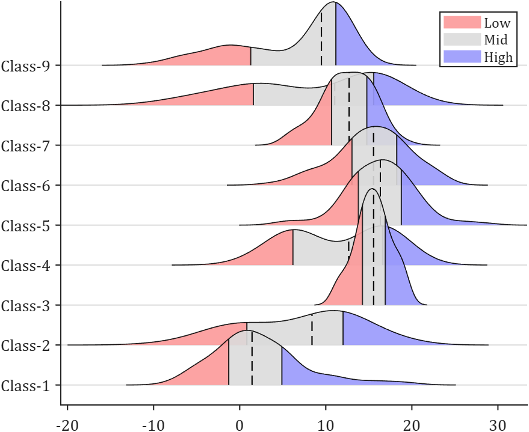
```matlab
%% demo 4 - 2 : Quantile coloring with 5 intervals (10%, 25%, 75%, 90%)
figure()
JP = joyPlot(Data, 'ColorMode','Qt', 'MedLine','on', 'Quantiles',[.1,.25,.75,.9], 'QtLine','on');
JP = JP.draw();
% Create handles for legend and display.
lgdHdl = JP.getLegendHdl();
legend(lgdHdl, {'0~0.1','0.1~0.25','0.25~0.75','0.75~0.9','0.9~1'})
% Change colors/colormap.
JP.setPatchColor(bone(6));
% JP.setPatchColor(turbo(6));
```
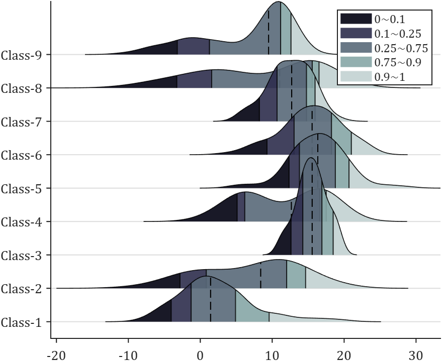
## Properties seting
```matlab
JP = joyPlot(Data, 'MedLine','on', 'Quantiles',[.1,.9], 'QtLine','on', 'Scatter','on');
JP = JP.draw();
% Customize appearance for each ridge.
for i = 1:length(Data)
    JP.setRidgePatch(i, 'FaceColor', [0.8, 0.8, 1], 'FaceAlpha', 0.9)            
    JP.setRidgeLine(i, 'LineWidth', 2, 'Color', [0.4, 0.4, 1])                   
    JP.setScatter(i, 'Color', [0.8, 0.8, 1, 0.7])                                
    JP.setMedLine(i, 'Color', [0.4, 0.4, 1], 'LineWidth', 5, 'LineStyle', '-')   
    JP.setQtLine(i, 'Color', [0.4, 0.4, 1])                                      
end
```
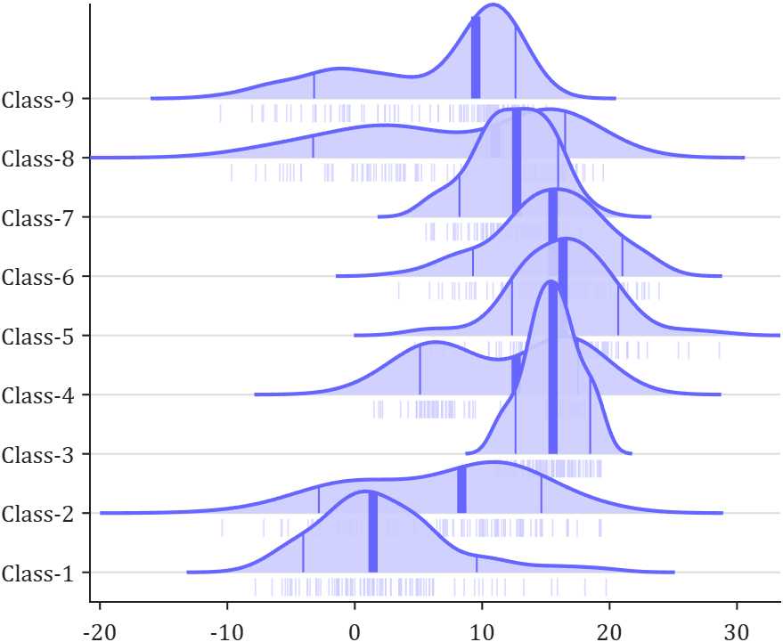
## Two groups of joyplot drawn in the same axes for comparison
```matlab
Data = load("demoData2.mat");
Data1 = Data.Data1;
Data2 = Data.Data2;
%% Plot Group 1 and Group 2
JP1 = joyPlot(Data1, 'ColorMode','Order', 'ColorList',[12,165,154]./255, 'MedLine','on', 'Scatter','on');
JP1 = JP1.draw();
JP2 = joyPlot(Data2, 'ColorMode','Order', 'ColorList',[151,220,71]./255, 'MedLine','on', 'Scatter','on');
JP2 = JP2.draw();
%% Change the colors of medlines.
for i = 1:length(Data1)
    JP1.setMedLine(i, 'Color',[12,165,154]./255)
end
for i = 1:length(Data2)
    JP2.setMedLine(i, 'Color',[151,220,71]./255)
end
%% Get legend handles (one dummy patch per group) and show legend.
lgdHdl1 = JP1.getLegendHdl();
lgdHdl2 = JP2.getLegendHdl();
legend([lgdHdl1(1), lgdHdl2(1)], {'AAAAA', 'BBBBB'})
```
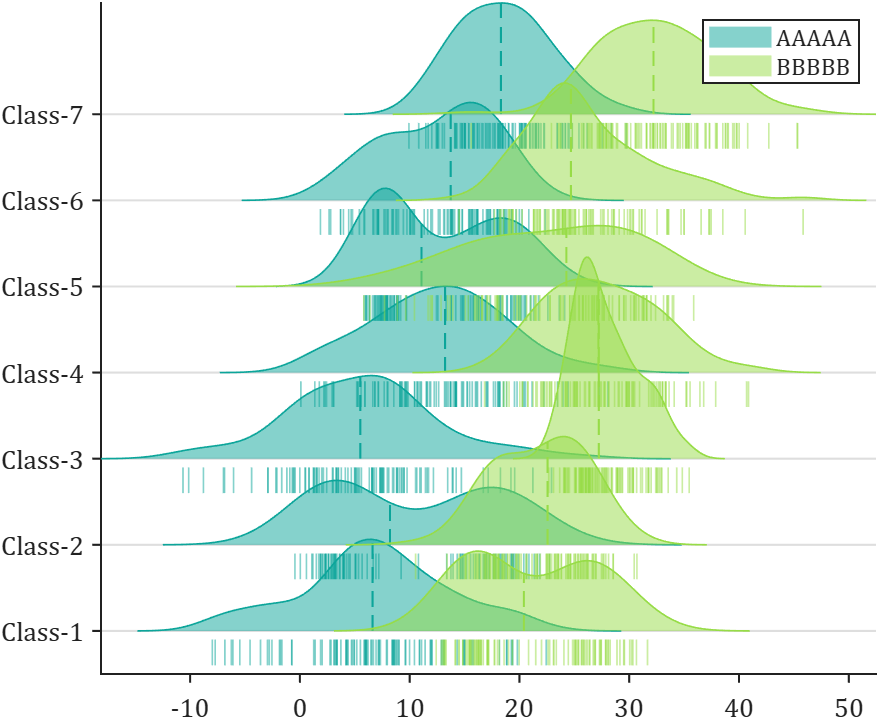